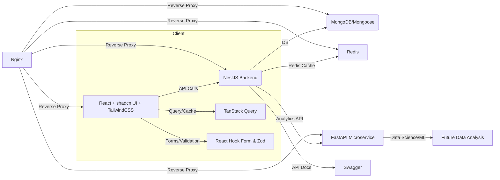

<!-- HERO BANNER -->

  
  
  
  
  
  
  
  
  
  
  
  
  
  

<h1 align="center">NestJS + React + Analytics Full-Stack Starter</h1>

  
  
  
  
  
  
  
  
  
  
  
  
  
  
  

---

<b>Table of Contents</b>

- [UI Gallery](#ui-gallery)
- [Features](#features)
- [Architecture](#architecture)
- [Tech Stack](#tech-stack)
- [Service Explanations](#service-explanations)
- [Development & Production](#development--production)
- [Testing & Linting](#testing--linting)
- [Contribution Guide](#contribution-guide)
- [FAQ](#faq)
- [Troubleshooting](#troubleshooting)
- [Credits & Inspiration](#credits--inspiration)

---

## 🎨 UI Gallery

  
  
  
   
  <i>Replace these with your actual UI screenshots for Kanban, Login, Signup, etc.</i>

---

## 🚀 Features

<!-- Responsive feature cards: 5 per row, will wrap on mobile -->
<table>
  <tr>
    <td align="center"> <b>NestJS Backend</b></td>
    <td align="center"> <b>React Frontend</b></td>
    <td align="center"> <b>MongoDB/Mongoose</b></td>
    <td align="center"> <b>FastAPI Analytics</b></td>
    <td align="center"> <b>Redis Cache</b></td>
  </tr>
  <tr>
    <td align="center"> <b>Nginx Proxy</b></td>
    <td align="center"> <b>TailwindCSS</b></td>
    <td align="center"> <b>TanStack Query</b></td>
    <td align="center"> <b>shadcn UI</b></td>
    <td align="center"> <b>React Hook Form</b></td>
  </tr>
  <tr>
    <td align="center"> <b>Zod Validation</b></td>
    <td colspan="4"></td>
  </tr>
</table>

<i>On mobile, features will wrap to the next line for better readability.</i>

---

## 🏗️ Architecture

---

## 🧰 Tech Stack

-  Progressive Node.js backend framework
-  Modern frontend UI
-  Type safety everywhere
-  Flexible NoSQL database
-  Python microservice for analytics
-  High-speed caching
-  Reverse proxy and load balancer
-  Utility-first CSS
-  Data fetching and caching
-  Beautiful, accessible UI components
-  Form state management
-  TypeScript-first schema validation

---

## 🧠 Service Explanations

>  **Nginx**
> 
> Acts as a reverse proxy, routing traffic to the correct service (frontend, backend, analytics). Handles SSL, load balancing, and static assets.
>
>  **Redis**
> 
> In-memory data store for caching, session management, and pub/sub. Greatly improves performance and scalability.
>
>  **FastAPI**
> 
> Python microservice for analytics, ML, and data science. Fast, async, and easy to extend.
>
>  **MongoDB/Mongoose**
> 
> Flexible NoSQL database, perfect for rapid development and scaling. Mongoose provides schema and validation for MongoDB in Node.js.
>
>  **Zod**
> 
> TypeScript-first schema validation for frontend and backend. Ensures data safety and developer happiness.
>
>  **React Hook Form**
> 
> Lightweight, performant form state management for React. Works beautifully with Zod.
>
>  **shadcn UI**
> 
> Accessible, beautiful React UI components. Built on top of Radix UI and TailwindCSS.
>
>  **TanStack Query**
> 
> Powerful data fetching, caching, and sync for React apps.
>
>  **TailwindCSS**
> 
> Utility-first CSS framework for rapid, responsive design.

---

## 🛠️ Development & Production

- **Local Development:**
  - Run all services with Docker Compose: `docker-compose up --build`