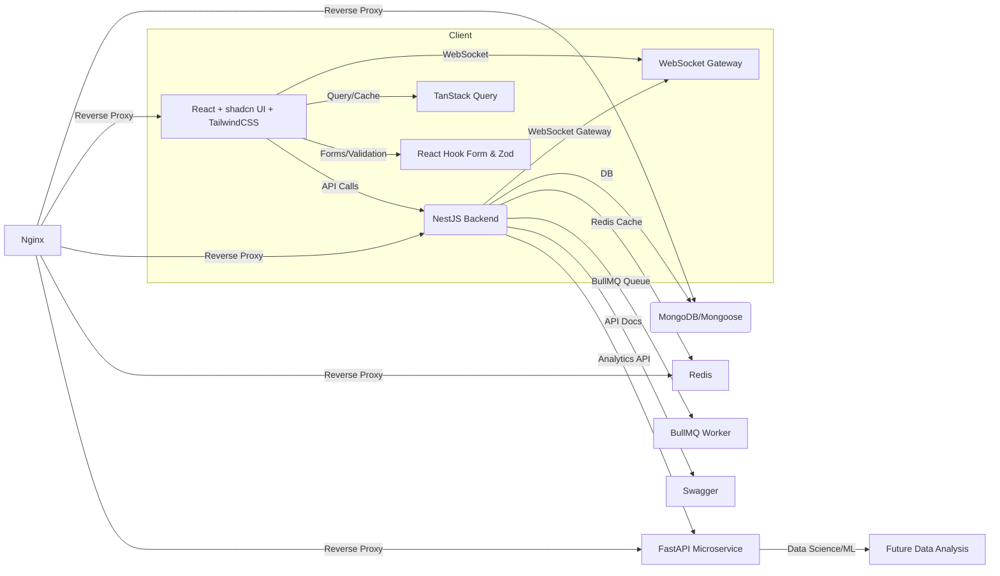

<div align="center">
  <h1>🚀 NestJS + React + FastAPI Full-Stack Starter</h1>
  <h3>Enterprise-Grade Full Stack Application Boilerplate with Real-time Features</h3>
  
  <p align="center">
    
    
    
    
  </p>

  <p align="center">
    
    
    
    
    
    
    
    
    
    
    
    
    
    
  </p>
</div>

<div align="center">
  <p>
    <a href="#features">Features</a> •
    <a href="#tech-stack">Tech Stack</a> •
    <a href="#getting-started">Getting Started</a> •
    <a href="#api-documentation">API Docs</a> •
    <a href="#deployment">Deployment</a>
  </p>
  
  <p>
    <a href="https://github.com/yourusername/nest-starter/actions/workflows/ci.yml">
      
    </a>
    <a href="https://codecov.io/gh/yourusername/nest-starter">
      
    </a>
    <a href="https://github.com/yourusername/nest-starter/issues">
      
    </a>
    <a href="https://discord.gg/your-invite">
      
    </a>
  </p>
</div>

## 🚀 Quick Start

Get up and running in minutes with our one-command setup:

```bash
# Clone the repository
git clone https://github.com/yourusername/nest-starter.git
cd nest-starter

# Start the development environment
docker-compose up -d
```

Visit `http://localhost:3000` to see the application in action!

## ✨ Key Features

### 🎯 Core Functionality
- **Authentication & Authorization**
  - JWT-based authentication with refresh tokens
  - Role-based access control (RBAC)
  - Social login integration (Google, GitHub)
  - Two-factor authentication (2FA)
  - Session management with Redis

- **User Management**
  - Profile management with avatar uploads
  - Email verification flow
  - Password reset functionality
  - User activity tracking
  - Account settings and preferences

- **Task Management**
  - Create, read, update, delete tasks
  - Task assignments and due dates
  - Priority levels and status tracking
  - Task comments and attachments
  - Task history and audit trail

- **Team Collaboration**
  - Create and manage teams
  - Team roles and permissions
  - Team discussions
  - File sharing and versioning
  - Team analytics and insights

### 🚀 Advanced Features
- **Real-time Updates**
  - WebSocket integration for live updates
  - Real-time notifications
  - Live chat functionality
  - Collaborative editing
  - Presence indicators

- **Analytics Dashboard**
  - User activity tracking
  - Performance metrics
  - Custom report generation
  - Data visualization
  - Export capabilities (CSV, PDF)

- **Developer Experience**
  - Comprehensive API documentation
  - TypeScript support throughout
  - Testing utilities
  - Development tools
  - Debugging helpers

## 🛠 Tech Stack

### Frontend
- **Framework**: React 18 with TypeScript
- **State Management**: React Query, Zustand
- **Styling**: Tailwind CSS with shadcn/ui
- **Form Handling**: React Hook Form with Zod validation
- **Routing**: React Router v6
- **Real-time**: Socket.IO Client
- **UI Components**: Radix UI Primitives, shadcn/ui
- **Icons**: Lucide React
- **Testing**: Jest, React Testing Library, Cypress

### Backend (NestJS)
- **Runtime**: Node.js 18+
- **Framework**: NestJS 10+
- **Database**: MongoDB with Mongoose
- **Cache**: Redis
- **Authentication**: JWT, Passport.js
- **Real-time**: WebSockets with Socket.IO
- **Queue**: BullMQ
- **Validation**: Class Validator, Class Transformer
- **API Documentation**: Swagger/OpenAPI
- **Testing**: Jest, Supertest

### Analytics (FastAPI)
- **Language**: Python 3.10+
- **Framework**: FastAPI
- **Data Processing**: Pandas, NumPy
- **Machine Learning**: scikit-learn (optional)
- **Visualization**: Matplotlib, Plotly
- **API Documentation**: Swagger UI, ReDoc

### DevOps
- **Containerization**: Docker, Docker Compose
- **CI/CD**: GitHub Actions
- **Monitoring**: Prometheus, Grafana
- **Logging**: Winston, ELK Stack (optional)
- **Error Tracking**: Sentry
- **Performance**: New Relic (optional)

## 📋 Table of Contents

<details open>
<summary>Click to expand/collapse</summary>

- [✨ Features](#-features)
- [🛠 Tech Stack](#-tech-stack)
- [🚀 Getting Started](#-getting-started)
  - [Prerequisites](#prerequisites)
  - [Installation](#installation)
  - [Environment Variables](#environment-variables)
- [🏗 Project Structure](#-project-structure)
- [📚 API Documentation](#-api-documentation)
- [🧪 Testing](#-testing)
- [🔒 Security](#-security)
- [🧩 Extending the Project](#-extending-the-project)
- [🤝 Contributing](#-contributing)
- [📄 License](#-license)
- [🙏 Acknowledgments](#-acknowledgments)
</details>

---

## 🎨 UI Gallery

<p align="center">
  
  
  
  
  
  
  
  
  <br/>
  <i>Gallery: Kanban Board, Task Scheduler, Team Collaboration, AI Assistant, Analytics, Notifications, Settings, Project Templates</i>
</p>

---

## 🆕 Latest Updates

### WebSockets Integration
- **Real-Time Features:**
  - WebSocket support is now available for real-time updates (e.g., notifications, chat, live task updates).
  - The backend exposes WebSocket gateways for instant client-server communication.

### BullMQ Queuing in Auth Flow
- **Asynchronous Notification Jobs:**
  - The authentication flow now uses BullMQ queues to handle login and verification notifications asynchronously.
  - When a user logs in, a notification job is enqueued and processed by a dedicated worker.

### Notification System
- **Modular Notification Delivery:**
  - Notifications are processed via BullMQ and can be delivered via email, WebSocket, or both.
  - The notification processor is modular and can be extended for additional channels.

---

## 🗂️ Project Structure & API Overview

### 🚦 Main Features

- **User Authentication & 2-Step Verification** (BullMQ-powered async email/notification delivery)
- **Task Management** (CRUD, caching, real-time updates via WebSocket)
- **Team, Note, Discussion, Message, Notification, Workspace Management** (RESTful APIs)
- **Real-Time Task Collaboration** (WebSocket gateway for tasks)
- **Modular Notification System** (email, WebSocket, BullMQ)
- **Rate Limiting, Caching, and Security** (Throttler, Redis, Helmet)
- **Analytics Microservice** (FastAPI)
- **Modern Email Templates** (table-based, inline CSS, compatible with all clients)

---

### 📚 Controllers & Routes

| Entity        | Controller                | Main Routes (REST)                                                                                   |
|---------------|---------------------------|------------------------------------------------------------------------------------------------------|
| User          | `/user`                   | `POST /login`, `POST /validate`, `POST /signup`, `PATCH /update-profile`, `POST /logout`             |
| Task          | `/task`                   | `POST /`, `GET /`, `GET /overdue`, `GET /stats`, `GET /:id`, `PATCH /:id`, `DELETE /:id`            |
| Team          | `/team`                   | `POST /`, `GET /`, `GET /:id`, `PATCH /:id`, `DELETE /:id`                                          |
| Note          | `/note`                   | `POST /`, `GET /`, `GET /:id`, `PATCH /:id`, `DELETE /:id`                                          |
| Discussion    | `/discussion`             | `POST /`, `GET /`, `GET /:id`, `PATCH /:id`, `DELETE /:id`                                          |
| Message       | `/message`                | `POST /`, `GET /`, `GET /:id`, `PATCH /:id`, `DELETE /:id`                                          |
| Notification  | `/notification`           | `POST /`, `GET /`, `GET /:id`, `GET /status/:status`                                                |
| Workspace     | `/workspace`              | `POST /`, `GET /`, `GET /:id`, `PATCH /:id`, `PATCH /join/:id`, `DELETE /:id`                       |

**WebSocket Gateway:**  
- `/task-process` (port 3001): Real-time task collaboration (add, update, remove, find tasks, etc.)

---

### 🛠️ Services

- **UserService**: User CRUD, password hashing, validation, friend management.
- **TaskService**: Task CRUD, caching, statistics, overdue logic.
- **TeamService, NoteService, DiscussionService, MessageService, NotificationService, WorkspaceService**: Standard CRUD and business logic.
- **NotificationService**: Handles notification creation, filtering, and status updates.
- **TaskProcessService**: Used by the WebSocket gateway for real-time task operations.

---

### 🔄 Real-Time & Queuing

- **WebSocket Gateway**:  
  - Located in `processes/task_process/task_process.gateway.ts`
  - Handles real-time task events (`add-task`, `find-all`, `find-one`, `update-task`, `remove-task`).

- **BullMQ Queues**:  
  - Used in authentication and notification flows.
  - Example: On login, a notification job is enqueued and processed asynchronously.

---

### 📝 Example API Usage

#### User Authentication

```http
POST /user/login
POST /user/validate
POST /user/signup
PATCH /user/update-profile
POST /user/logout
```

#### Task Management

```http
POST /task
GET /task
GET /task/overdue
GET /task/stats
GET /task/:id
PATCH /task/:id
DELETE /task/:id
```

#### Notification

```http
POST /notification
GET /notification
GET /notification/:id
GET /notification/status/:status
```

#### Real-Time Task Collaboration

- Connect to WebSocket on port 3001
- Emit events: `add-task`, `find-all`, `find-one`, `update-task`, `remove-task`

---

### 🧩 How to Extend

- **Add new REST endpoints**: Create a new controller and service, register in the module.
- **Add new real-time features**: Add new WebSocket events in the gateway and service.
- **Add new notification channels**: Extend the notification processor to support SMS, push, etc.

---

## 🚀 Features

<!-- Responsive feature cards: 5 per row, will wrap on mobile -->
<table>
  <tr>
    <td align="center"><br/><b>NestJS Backend</b></td>
    <td align="center"><br/><b>React Frontend</b></td>
    <td align="center"><br/><b>MongoDB/Mongoose</b></td>
    <td align="center"><br/><b>FastAPI Analytics</b></td>
    <td align="center"><br/><b>Redis Cache</b></td>
  </tr>
  <tr>
    <td align="center"><br/><b>Nginx Proxy</b></td>
    <td align="center"><br/><b>TailwindCSS</b></td>
    <td align="center"><br/><b>TanStack Query</b></td>
    <td align="center"><br/><b>shadcn UI</b></td>
    <td align="center"><br/><b>React Hook Form</b></td>
  </tr>
  <tr>
    <td align="center"><br/><b>Zod Validation</b></td>
    <td colspan="4"></td>
  </tr>
</table>
<p align="center"><i>On mobile, features will wrap to the next line for better readability.</i></p>

---

### 🆕 Workspace Management API

The backend now supports advanced workspace management features:

- **Create Workspace**: Create a new workspace for your projects or teams.
- **Get All Workspaces**: List all workspaces accessible to the authenticated user, with support for pagination, search, sorting, and status filtering.
- **Get Workspace by ID**: Retrieve details of a specific workspace if you have access.
- **Update Workspace**: Update the details of a workspace you own.
- **Join Workspace**: Add users to a workspace by their IDs.
- **Delete Workspace**: Remove a workspace you own.

**Workspace API Routes:**

| Method | Route                   | Description                                                                                  | Auth Required | Latest Feature? |
|--------|-------------------------|----------------------------------------------------------------------------------------------|:-------------:|:--------------:|
| POST   | `/workspace`            | Create a new workspace.                                                                      | Yes           |                |
| GET    | `/workspace`            | List all workspaces accessible to the user. Supports pagination, search, sort, and status.   | Yes           |                |
| GET    | `/workspace/:id`        | Get a specific workspace by ID, if accessible.                                               | Yes           |                |
| PATCH  | `/workspace/:id`        | Update a workspace (if owned by the user).                                                   | Yes           |                |
| PATCH  | `/workspace/join/:id`   | Add users to a workspace by their IDs.                                                       | Yes           |      ✅        |
| DELETE | `/workspace/:id`        | Delete a workspace (if owned by the user).                                                   | Yes           |                |

#### Latest Added Feature: Join Workspace

- **Join Workspace (`PATCH /workspace/join/:id`)**  
  Allows the owner of a workspace to add multiple users to the workspace by providing their user IDs. This endpoint ensures only authorized users can add others, and returns an error if the workspace is not found or the user is unauthorized.

All endpoints require authentication. Ownership and access checks are enforced for sensitive operations.

---

## 📚 API Overview

### Authentication & Notification Flow

- **Login:**
  - User submits credentials.
  - On success, a verification code is generated and sent via email (using BullMQ queue for async delivery).
  - A notification job is also enqueued for login events.
  - WebSocket events can be emitted for real-time feedback (e.g., "new login detected").

- **Notification API:**
  - Notifications can be triggered by user actions (login, task updates, etc.).
  - Each notification is enqueued and processed by a worker.
  - Delivery can be via email, WebSocket, or both, depending on user settings.

### User API

| Method | Route                | Description                                                                                  | Latest Feature? |
|--------|----------------------|----------------------------------------------------------------------------------------------|:--------------:|
| POST   | `/user/login`        | Login with email and password. Sends a verification code to email for 2-step verification.   |                |
| POST   | `/user/validate`     | Validate the verification code sent to email. Issues JWT on success.                         |      ✅        |
| POST   | `/user/signup`       | Register a new user. Checks for duplicate name/email.                                        |                |
| PATCH  | `/user/update-profile`| Update user profile (name, password).                                                        |                |
| POST   | `/user/logout`       | Log out the current user.                                                                    |                |

**Latest Feature:**  
- **2-Step Email Verification on Login:**  
  After login, a verification code is sent to the user's email. The user must validate this code to complete authentication.

---

### Task API

| Method | Route                | Description                                                                                  | Latest Feature? |
|--------|----------------------|----------------------------------------------------------------------------------------------|:--------------:|
| POST   | `/task`              | Create a new task. User is auto-assigned as owner.                                           |                |
| GET    | `/task`              | List all tasks for the user. Supports pagination, filtering, sorting, and search.            |                |
| GET    | `/task/overdue`      | List all overdue tasks for the user.                                                         |      ✅        |
| GET    | `/task/stats`        | Get statistics (total, overdue, by status) for the user's tasks.                             |      ✅        |
| GET    | `/task/:id`          | Get a specific task by ID. Uses caching for performance.                                     |                |
| PATCH  | `/task/:id`          | Update a task. Updates cache if present.                                                     |                |
| DELETE | `/task/:id`          | Delete a task. Removes from cache.                                                           |                |

**Latest Features:**  
- **Overdue Tasks Endpoint:**  
  Easily fetch all overdue tasks for the user.
- **Task Statistics Endpoint:**  
  Get a summary of total, overdue, and status breakdown for tasks.

---

### Workspace API

| Method | Route                   | Description                                                                                  | Latest Feature? |
|--------|-------------------------|----------------------------------------------------------------------------------------------|:--------------:|
| POST   | `/workspace`            | Create a new workspace.                                                                      |                |
| GET    | `/workspace`            | List all workspaces accessible to the user. Supports pagination, search, sort, and status.   |                |
| GET    | `/workspace/:id`        | Get a specific workspace by ID, if accessible.                                               |                |
| PATCH  | `/workspace/:id`        | Update a workspace (if owned by the user).                                                   |                |
| PATCH  | `/workspace/join/:id`   | Add users to a workspace by their IDs.                                                       |      ✅        |
| DELETE | `/workspace/:id`        | Delete a workspace (if owned by the user).                                                   |                |

**Latest Feature:**  
- **Join Workspace:**  
  Owners can add multiple users to a workspace by their IDs.

---

### Team, Note, Discussion, Message, Notification APIs

All these controllers follow a similar RESTful pattern:

| Method | Route                | Description                        |
|--------|----------------------|------------------------------------|
| POST   | `/entity`            | Create a new entity                |
| GET    | `/entity`            | List all entities                  |
| GET    | `/entity/:id`        | Get a specific entity by ID        |
| PATCH  | `/entity/:id`        | Update an entity                   |
| DELETE | `/entity/:id`        | Delete an entity                   |

Replace `/entity` with `/team`, `/note`, `/discussion`, `/message`, or `/notification` as appropriate.

---

## 🏗️ Architecture



---

## 🧰 Tech Stack

-  Progressive Node.js backend framework
-  Modern frontend UI
-  Type safety everywhere
-  Flexible NoSQL database
-  Python microservice for analytics
-  High-speed caching
-  Reverse proxy and load balancer
-  Utility-first CSS
-  Data fetching and caching
-  Beautiful, accessible UI components
-  Form state management
-  TypeScript-first schema validation

---

## 🧠 Service Explanations

> **WebSocket Gateway**
> - Enables real-time communication between backend and frontend for notifications, chat, and live updates.
>
> **BullMQ**
> - Used for queuing notification jobs, especially in the authentication flow (e.g., login notifications).
> - Ensures reliable, scalable, and asynchronous processing of background tasks.
>
> **Notification System**
> - Modular, supports both email and WebSocket delivery.
> - Easily extendable for SMS, push, or other channels.

---

## 🛠️ Development & Production

- **Local Development:**
  - Run all services with Docker Compose: `docker-compose up --build`
